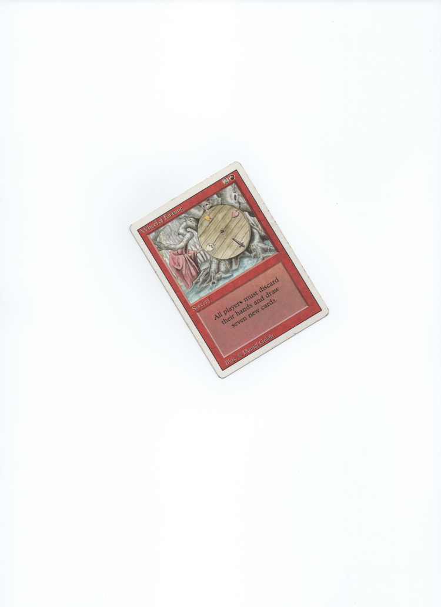
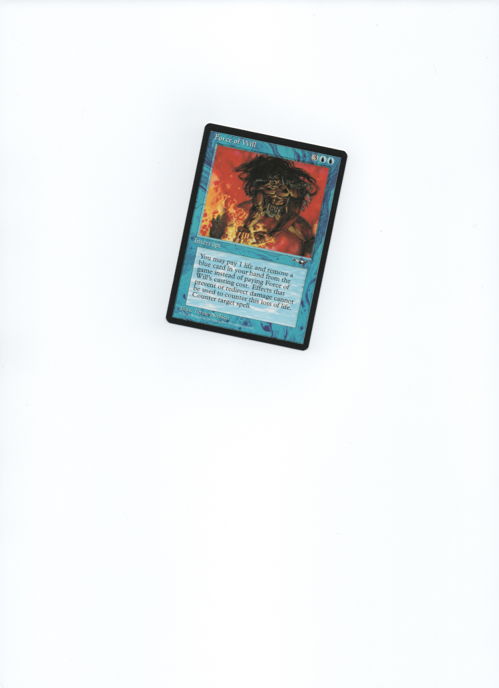
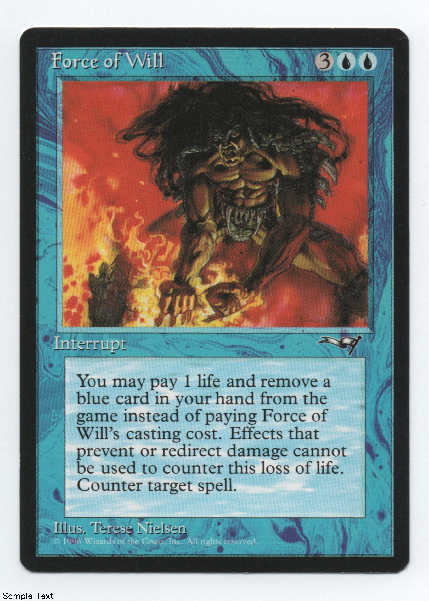

# Scan buddy
Python utility to auto rotate and crop scans of tcg cards.

### Demo

<table>
  <thead>
      <tr>
          <th scope="col">Input</th>
          <th scope="col">Output</th>
      </tr>
  </thead>
    <tr>
    <td>  </td>
    <td>  </td>
  </tr>
</table>

```
python index.py -i demo/wof-front.jpg -o demo/wof-front-op.jpg -s 1.2 -t "Wheel of Fortune HP"
```


<table>
  <thead>
      <tr>
          <th scope="col">Input</th>
          <th scope="col">Output</th>
      </tr>
  </thead>
    <tr>
    <td>  </td>
    <td>  </td>
  </tr>
</table>

```
python index.py -i demo/fow-front.jpg -o demo/fow-front-op.jpg -s 1.1 -t "Sample Text"
```

### Todo
- different font
- id's
- Bulk import option
~~ - Crop sizing ~~
~~ - Custom text ~~
